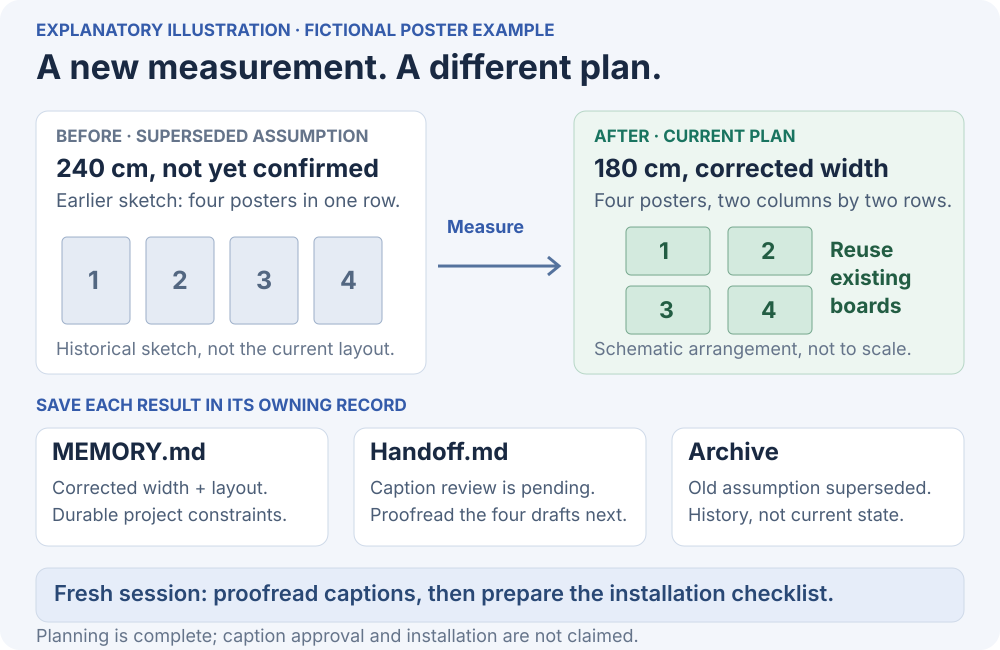
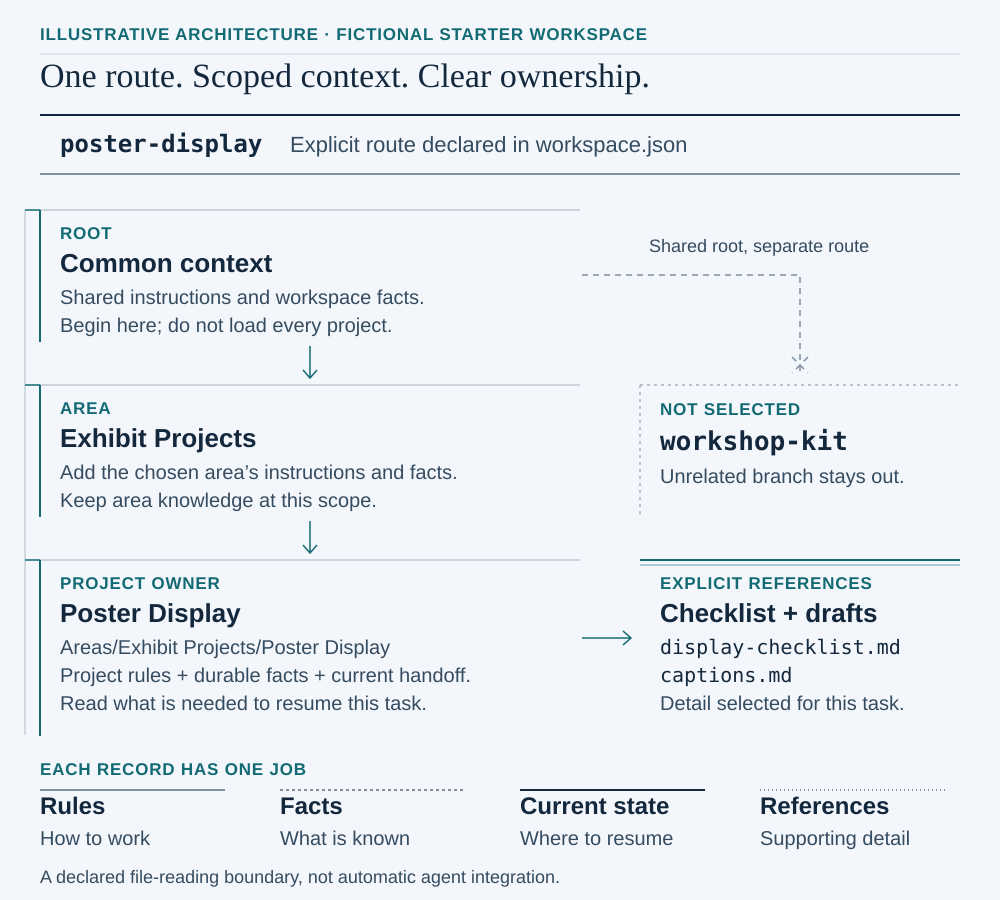
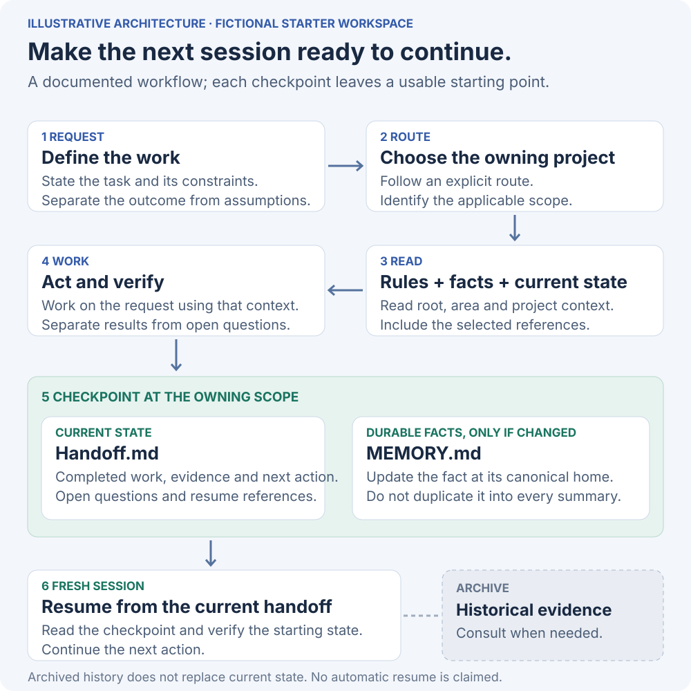

# Second Brain

**A file-based workspace that gives an AI-assisted project a clear place for its rules, decisions and next action.**

Long projects rarely fit in one conversation. A new session needs to know which instructions apply, which facts still hold and where work stopped. Second Brain demonstrates an architecture for keeping that context in a small, explicit set of files.

This repository is a **fictional starter workspace and a working read-only validator**, adapted from my personal WorkOS design. It is not a chat application or an automatic memory service. All example projects, decisions and dates were created for this public edition.

[Walk through a task](docs/walkthrough.md) · [Explore the architecture](docs/architecture.md) · [Run the checks](#run-the-checks) · [Design tradeoffs](docs/evolution-and-tradeoffs.md) · [Contribution and provenance](PROVENANCE.md)

## Follow one request

> “The display is narrower than expected. Update the poster layout and leave the next session ready to continue.”



The corrected measurement lives in project memory. The handoff keeps caption review as the next action; the archive labels the earlier assumption as superseded. A returning reader can follow those records without treating the old plan as current.

The repository contains the **after-checkpoint state**. The [walkthrough](docs/walkthrough.md) explains how it was reached and how to resume it. The checker validates structure and reports selected files; it does not make the layout decision or operate an AI model.

## How context is selected



The architecture separates two decisions: **which files apply** and **what each file owns**. Directory scope answers the first. Distinct records for rules, durable facts, current state and historical evidence answer the second.

| Record | Owns | Does not replace |
| --- | --- | --- |
| `AGENTS.md` | Instructions for its scope | Facts about the current project |
| `MEMORY.md` | Durable facts and settled decisions at the narrowest owning level | A running transcript |
| `Handoff.md` | Current state, the next action and unresolved questions | Permanent project history |
| Reference documents | Detail needed for a particular step | The current task's status |
| `SESSION_LOG_ARCHIVE.md` | Superseded checkpoints and historical context | The current handoff |

This is an ownership convention, not a synchronization engine. An agent or person must read the selected files and maintain the correct record. Host-specific instruction loading is explained in [architecture](docs/architecture.md).

## From checkpoint to a new session



The important output is a usable next step. In the example, [project memory](example/Areas/Exhibit%20Projects/Poster%20Display/MEMORY.md) owns the corrected measurement, the [handoff](example/Areas/Exhibit%20Projects/Poster%20Display/Handoff.md) owns the pending caption review, and [history](example/Areas/Exhibit%20Projects/Poster%20Display/SESSION_LOG_ARCHIVE.md) preserves the earlier assumption with an explicit superseded label.

## Run the checks

Requires Python 3.10 or later. No packages, accounts or network access are required.

```sh
python3 scripts/check_workspace.py --route poster-display
python3 scripts/check_workspace.py --route workshop-kit --json
python3 -m unittest discover -s tests -v
```

The validator audits required files, declared paths and supported local Markdown links across the example. Separately, it reports the selected route's ordered context files and their byte sizes. The structural audit reads other branches too; those files do not enter the selected context list. It does not edit the example, archive it, send prompts or call a model. Byte counts describe these files, not tokens saved or performance gains.

Change a route, remove a required handoff or break a local link in a **copy** of the example to see the validation fail. The test suite exercises those failure cases without changing the shipped example. See `--help` for a custom workspace path.

## Explore the implementation

| Start here | What it demonstrates |
| --- | --- |
| [Example route configuration](example/workspace.json) | Two explicit project routes with declared references |
| [Fictional workspace](example/AGENTS.md) | Root, area and project scope without private operating rules |
| [Reusable templates](templates/AGENTS.md) | Small starting records with one responsibility each |
| [Read-only validator](scripts/check_workspace.py) | Deterministic context selection, path boundaries and link checks |
| [Regression tests](tests/test_workspace.py) | Missing state, broken references and unsafe path failures |
| [Verification record](docs/verification.md) | Fifteen tests and one independent fresh-reader exercise, with explicit limits |
| [Architecture](docs/architecture.md) | Ownership, dependency boundaries, lifecycle and host behavior |
| [Evolution and tradeoffs](docs/evolution-and-tradeoffs.md) | Duplicate state, stale notes, concurrent writers and recovery limits |

## My contribution

I developed WorkOS as a personal system for organizing ongoing work with AI assistance. I defined the need for persistent project context, pushed for clearer ownership when repeated logging created friction, and iterated on the workspace structure and operating conventions with agents.

This public edition makes those design decisions inspectable through a fictional example, diagrams and validation code. AI tools assisted with research, writing, implementation and verification. The [provenance record](PROVENANCE.md) distinguishes the original design from the newly built public demonstration.

## Limits

The validator cannot determine whether a remembered fact is true, whether a checkpoint is useful or whether an agent follows an instruction. It does not resolve concurrent edits, repair stale decisions, provide access control or detect every kind of sensitive content. The example's route list is explicit, not semantic search. No measured time savings, token savings or universal host compatibility are claimed.

No open-source license has been selected for this edition.
